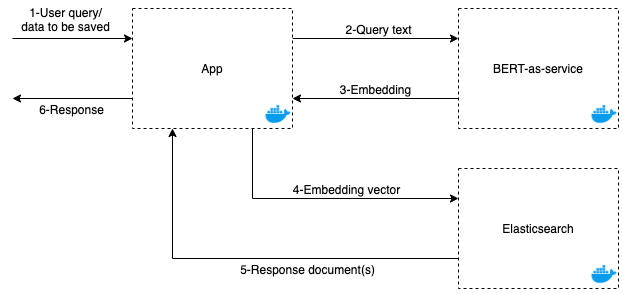

# bert-elastic-search

In this project, i implemented a semantic search engine based on text vectors similarity. In this type of search, a user enters a short free-text query, and documents are ranked based on their similarity to the query.

In this implementation, i used BERT (Bidirectional Encoder Representations from Transformers) language model to encodes words and sentences as numeric vectors (or text embeddings). These vector representations are designed to capture the linguistic content of the text, and can be used to assess similarity between a query and a document.

This project explores how text embeddings and Elasticsearch’s `dense_vector` type could be used to support similarity search.

# Architecture

The following schema present the global architecture and the interactions between the diffrent components:

<p align="center">
  
</p>

The architecture is composed of the following components:

## Elasticsearch: 
An elasticsearch server to store & search data.

## BERT-as-service: 
Exposing a pre-trained BERT model using a REST API with Flask. The aim of this component is to get the embedding of a text. The service implementation is based on [Hugging Face library](https://huggingface.co/transformers/).

The component is customizable. You can change & use one of the following [pretrained models on Hugging Face](https://huggingface.co/transformers/pretrained_models.html). To acheive that, use the `config.json` file inside `/bert-as-service`:

```
{
  # The pretrained model ID from the link above
  "model": "bert-base-uncased",
  "import_model": false,
  "model_dir": "./model/pytorch_model.bin"
}
```

In case you want to use your own, fine-tuned model, set `import_model` to `True`, and specify the model's path from the root directory with `model_dir`.

**Note:** You can start the BERT service from the notebook in `/notebooks`. Use Google Colab to import the model, & run the service. The server will be exposed publicly using [ngrok](https://ngrok.com/). -Just run all the cells ;)-.

## App: 
a simple NodeJs app, that has three routes: add a text, search for a text, and get the embeddings of a text.
In order to run the app, you should add a `.env` file containing the following variables:
```
{
  MONSTER_MONGO_DB_URI = <DB_URL>
  BERT_SERVICE_URI = <BERT_URL>
  ELASTIC_SEARCH_URI = <ELASTIC_URL>
}
```
You can either point to the containers, or you can use external services, e.g: your own elasticsearch instance, or a BERT service instance running on Google Colab.

To run the application, simply use the `docker-compose` command:
```
docker-compose -f docker-compose.yml up -d --build
```